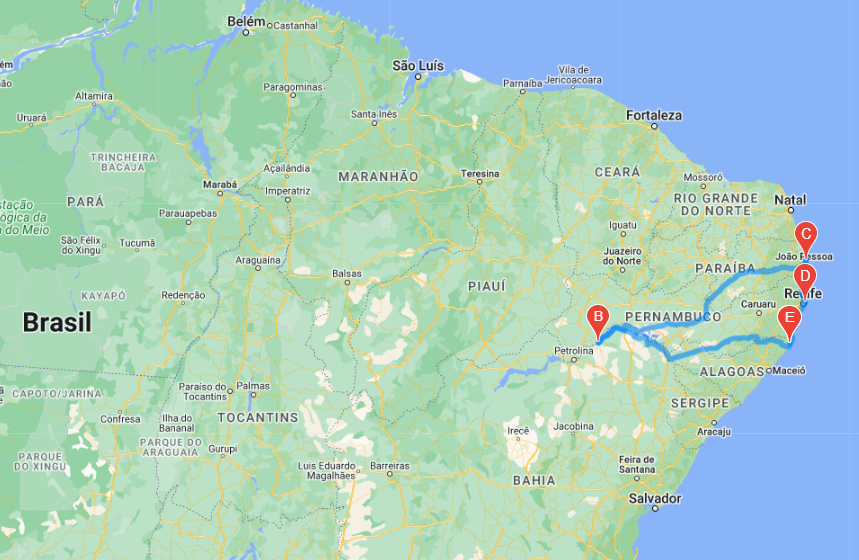
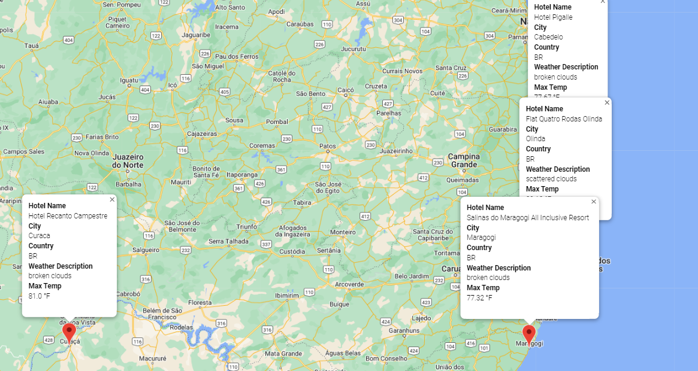

# PlanMyTrip_app

## Project Overview

Execute a few changes in the PlanMyTrip app, such as adding the weather description to the weather data, use input statements to filter the data for users weather preferences and travel itinerary features.

Analysis key deliverables:

1. Retrieve Weather Data
2. Create a Customer Travel Destinations Map
3. Create a Travel Itinerary Map

This project was fully developed in Python, code can be checked at the following links:

[Weather_Database.ipynb](Weather_Database/Weather_Database.ipynb)
[Vacation_Search.ipynb](Vacation_Search/Vacation_Search.ipynb)
[Vacation_Itinerary.ipynb](Vacation_Itinerary/Vacation_Itinerary.ipynb)

## Resources

[WeatherPy_Database.csv](Weather_Database/WeatherPy_Database.csv)

[WeatherPy_vacation.csv](Vacation_Search/WeatherPy_vacation.csv)

## Results

